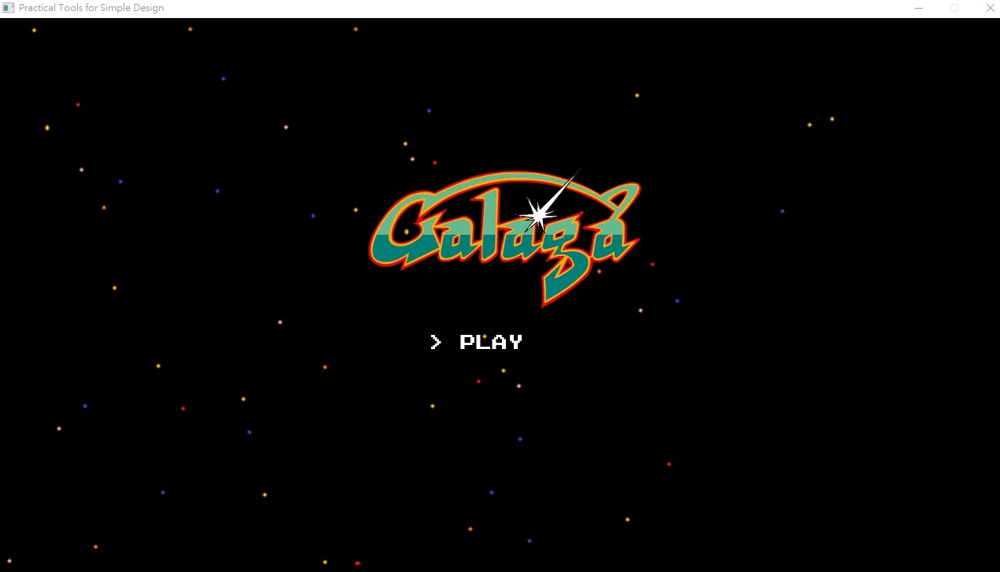
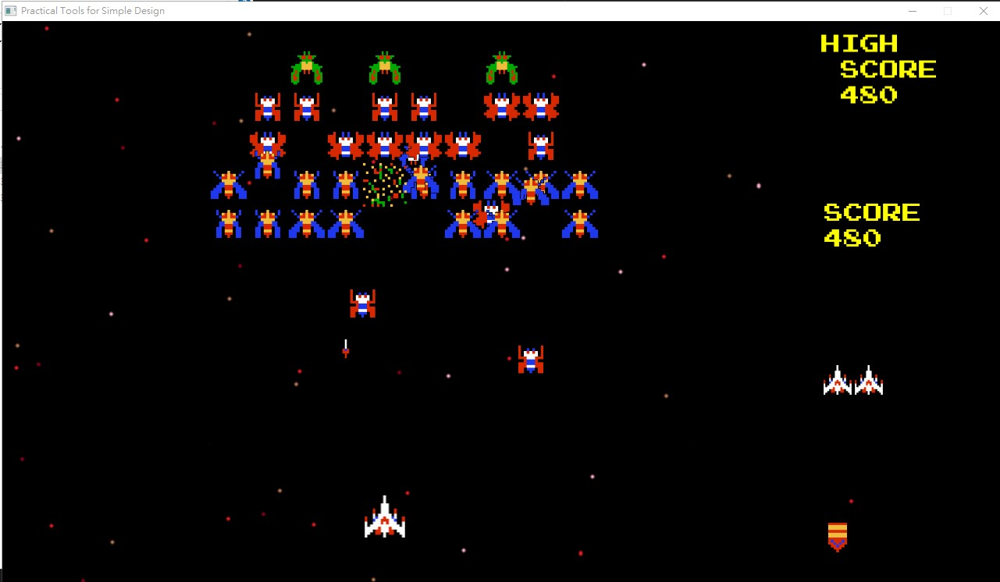
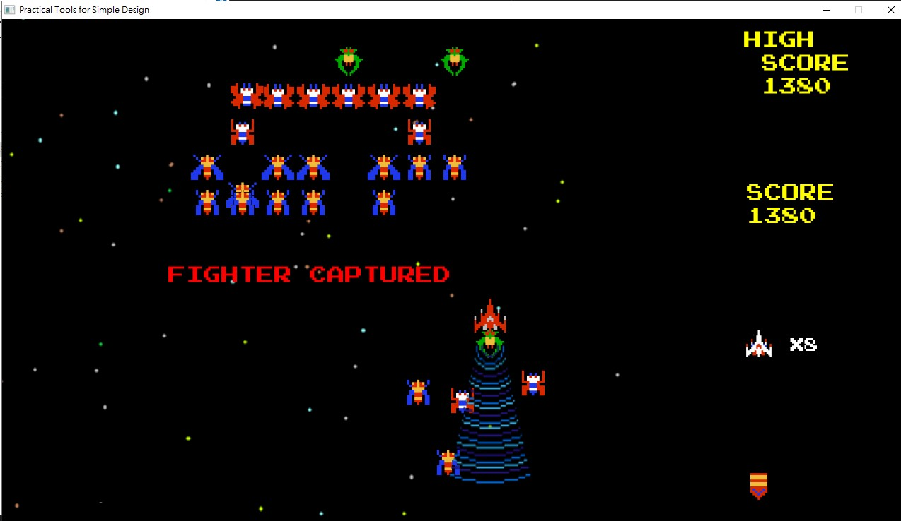
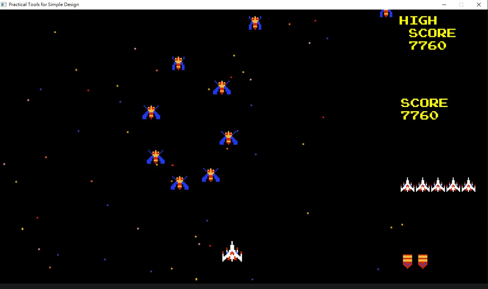
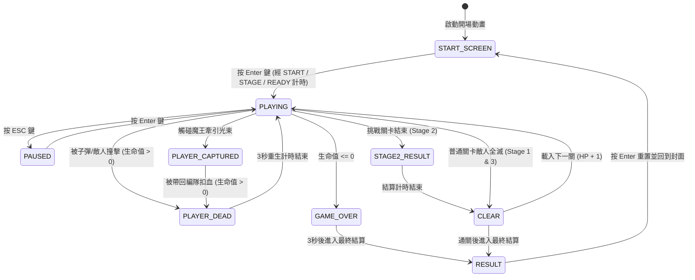

# 2026 OOPL Final Report

## 組別資訊

組別：T54
組員：113590024 林秉緯、113590044 黃熠瑋
復刻遊戲：大蜜蜂(Galaga)

## 專案簡介

### 遊戲簡介
* **復刻對象**：1981年 Namco 發行的經典街機射擊遊戲《大蜜蜂 (Galaga)》。
* **開發框架**：本專案採用 PTSD 框架與 C++ 實作。
* **復刻亮點**：
  1. **敵機種類與多樣化攻擊**：
     * **Zako (蜜蜂)**：分數 100 分。俯衝時有 10% 機率朝玩家發射子彈。
     * **Butterfly (蝴蝶)**：分數 80 分。以弧線形俯衝，增加玩家閃避的難度，俯衝時有 10% 機率朝玩家發射子彈。
     * **Dragonfly (蜻蜓)**：分數 150 分。具備四影格的展翅飛行與盤旋動作，只出現於挑戰關卡。
     * **Boss Galaga (魔王)**：分數 100 分。擁有 2 點生命值（受傷一次後會從綠色變成藍色）。魔王俯衝時有 5% 機率釋放**藍色牽引光束（Tractor Beam）**。
  2. **經典魔王擄獲機制**：魔王發射藍色牽引光束，玩家戰機若觸碰光束會被強行吸取，變為紅色敵方戰機，玩家扣減 1 點生命值。
  3. **關卡挑戰與回饋**：
     * **Stage 1 & 3**：具備敵機進場編隊、待機、以及隨機俯衝射擊的標準玩法。
     * **Stage 2 (挑戰關卡)**：敵人依據特定路徑飛入並直接飛出螢幕，**不會再飛回編隊**。此關卡不攻擊玩家，專門考驗玩家的擊落數量與命中率，全滅可獲得 `PERFECT!!` 評價。
     * **關卡過關回饋**：當玩家成功清空關卡進入下一關時，**會 +1 HP**。

### 組別分工
| 組員姓名    | 主要負責模組與工作                                                                                                                                                                                                                        |
| :------ | :------------------------------------------------------------------------------------------------------------------------------------------------------------------------------------------------------------------------------- |
| **林秉緯** | 1. 專案建立<br>2. 開場動畫與結尾動畫設計<br>3. 全部的文字建立與擺放<br>4. 玩家與敵人基本建立<br>5. 敵人動畫設計<br>6. 爆炸與子彈射擊動畫設計<br>7. BOSS Galaga 藍色光束製作<br>8. Stage 2、3 的編隊與入場路徑製作<br>9. UI 介面、生命值與旗標圖示建立<br>10. 音效 SFX 資源建立<br>11. 雙手操作設計<br>12. 遊戲結束後循環設計           |
| **黃熠瑋** | 1. 碰撞偵測機制與玩家生命值/無敵管理<br>2. 敵人攻擊機率設計<br>3. 單手操作設計<br>4. 外掛 / 密技功能設計（按 `P` 鍵生命值 +2）<br>5. 玩家與敵人死亡機制設計<br>6. 敵人射擊設計<br>7. 所有敵人內部函式設計<br>8. 玩家內部函式設計<br>9. 敵人與子彈物件消失與清理機制<br>10. Stage 1、3 的編隊與入場路徑製作<br>11. 關卡建構、波次 Wave 的銜接與關卡銜接邏輯 |

## 遊戲介紹

### 遊戲規則
1. **操作方式（分為單手與雙手）**：
   * **雙手操作（推薦）**：按鍵盤方向鍵 `Left` / `Right` 控制戰機左右移動，按 `Z` 或 `X` 鍵發射子彈。
   * **單手操作**：按 `A` / `D` 鍵控制戰機左右移動，按 `W` 鍵發射子彈。
   * **暫停**：按 `ESC` 暫停遊戲，按 `ENTER` 鍵繼續遊戲。
   * **外掛 / 密技**：測試或通關困難時，玩家可按下 `P` 鍵觸發外掛功能，**直接為戰機增加 2 點生命值**。
2. **勝負條件**：
   * 勝利：成功通關三個關卡，進入 `RESULT` 成績結算。
   * 失敗：戰機生命值 HP 歸零，顯示 `GAME OVER`。
3. **過關獎勵**：
   * 每當成功進入下一關時，會**增加 1 點生命值**，畫面上最多顯示 5 個生命圖示，大於 5 個時則會改以文字（例如 `x6`）表示。
4. **擄獲機制**：
   * 當玩家碰到魔王發射的藍色牽引光束時，遊戲狀態轉換為 `PLAYER_CAPTURED`，玩家控制權暫時喪失，戰機變為紅色，隨後玩家扣減 1 點生命值並重新在下方重生。
5. **挑戰關卡（Stage 2）規則**：
   * 關卡二為挑戰關卡，所有敵人依照貝茲曲線路徑滑行過螢幕。
   * 敵人跑完其預定路徑後便會直接飛離螢幕，不會再返回編隊。
   * 此關卡敵人不會攻擊，目標是盡可能在他們飛離前予以擊落，結算時會統計命中數量。
   * 若 40 隻敵人全數擊落，畫面上會額外顯示 **PERFECT!!** 評價。

### 遊戲畫面

**圖一：遊戲封面與開場動畫**




## 程式設計

### 程式架構
說明專案的類別繼承結構與狀態轉換邏輯：

1. **展示所有類別**：
```
App.hpp (遊戲主流程)
Enemy.hpp (敵人父類別)
 ├──Boss_Galaga.hpp (BOSS Galaga)
 ├──Butterfly.hpp (蝴蝶)
 ├──Dragonfly.hpp (蜻蜓)
 └──Zako.hpp (蜜蜂)
Cursor.hpp (創建箭頭)
Enemy_bullet.hpp (敵人子彈)
Explosion.hpp (爆炸動畫)
Label.hpp (字幕)
PLAYER.hpp (玩家)
Player_bullet.hpp (玩家子彈)
Sprite.hpp (圖片)
Stage.hpp (關卡父類別)
 ├──Stage1.hpp (第一關)
 ├──Stage2.hpp (第二關)
 └──Stage3.hpp (第三關)

AppStart.cpp (創建遊戲環境)
AppUpdate.cpp (遊戲進行)
main.cpp (遊戲流程)
PLAYER.cpp (玩家圖片、移動設置)
```

2. **遊戲狀態機轉換圖 (State Transition Diagram)**：



### 程式技術

1. **多型與繼承 (Polymorphism & Inheritance)**：
    
    - 所有敵人（蜜蜂、蝴蝶、魔王、蜻蜓）都繼承 `Enemy`，並各自實作 `StartDive()` 俯衝行為或抓人邏輯。
    - 透過多型呼叫，關卡管理器不需要關心目前是哪種敵人，直接呼叫基底類別的通用介面進行行為更新。
    
2. **貝茲曲線進場路徑與不返回機制 (Bezier Curves)**：
    
    - 敵人的進場飛行軌跡使用三次貝茲曲線動態繪製。
    - 挑戰關卡 (Stage 2) 實作了「不返回編隊」機制：在 `Stage2::Update` 中，每影格檢查 `enemy->IsOutOfScreen()`，若敵機飛出邊界，直接調用 `enemy->Kill()` 並將其列入 Miss 統計。
    
3. **回呼函式與事件驅動 (Callbacks)**：
    
    - 敵機發射子彈採用 `std::function<void(const glm::vec2&)>` 。當射擊時，回傳座標給 `App` 類別，在外部產生 `Enemy_bullet` 物件，確保了敵機與主邏輯之間的低耦合性。

### 使用到 AI/AI Agent 的部分 (沒有用到者，不需要寫這篇)
Codex、Claude。
* **專案開發輔助**：
  * **初步建設專案**：在專案初期的環境建置與基本類別宣告時，請 AI 協助快速搭出框架與連接 PTSD 繪圖函式庫。
  * **架構整理與建議**：在開發過程中，針對部分功能（如狀態機轉換、關卡管理器設計）請 AI 提供架構上的重構建議。
  * **Debug 除錯**：協助排除記憶體指標錯誤、編譯警告以及 PTSD 渲染樹物件銷毀順序導致的崩潰。

## 結語

### 問題與解決方法
1. **問題一：敵機飛行路徑設計困難**
   * **說明**：專案開發初期，對於如何讓敵人呈現經典大蜜蜂的旋繞、圓弧滑行飛行路徑沒有頭緒，不知道如何設計路徑軌跡與實作演算法。
   * **解決方法**：向 AI 詢問飛行路徑的架構設計與實作方法，AI 教導了我們「三次貝茲曲線（Cubic Bezier Curve）」公式的數學原理、如何設定控制點，以及在程式中如何使用參數 $t$ 動態求出移動坐標，這使我們能成功實作 Zako、Butterfly、Dragonfly 與 Boss 滑順的出場與俯衝軌跡。 透過參數 $t$（$0 \le t \le 1$）與四個控制點（$P_0, P_1, P_2, P_3$）動態求出移動座標：


2. **問題二：Galaga 抓人機制的空中衝突與敵人干擾**
   * **說明**：在設計 Galaga 的牽引光束抓人時，若玩家在被藍色光束吸取、緩慢往上升的途中（`PLAYER_CAPTURED` 狀態中），其他編隊中的敵人仍會繼續發動俯衝攻擊，導致玩家有機率會在空中直接被撞到。或是多隻 Galaga 同時發射光束下來抓人，程式邏輯會產生衝突。
   * **解決方法**：
     * **阻斷俯衝**：為了保證玩家被抓取時的邏輯正常，在 `PLAYER_CAPTURED` 狀態下，首先讓所有敵機呼叫 `Playerdead()` 函式，將內部的 `stopdiving` 設為 `true`，從而阻斷所有敵人在玩家被抓期間進行俯衝。
     * **限制單人抓取**：在 `Enemy` 中使用靜態成員變數 `s_IsAnyoneCapturing` 做為全域旗標。當有 Galaga 進入抓人流程時，將此旗標設為 `true` 阻斷其他 Galaga 在同一時間進入抓人軌跡；直到該魔王結束抓人或被擊毀時，才重置旗標為 `false`，確保了 Galaga 抓人邏輯的唯一性。

### 自評

| 項次  | 項目                      | 完成  |
| --- | ----------------------- | --- |
| 1   | 這是範例                    | V   |
| 2   | 完成專案權限改為 public         | V   |
| 3   | 具有 debug mode 的功能       | V   |
| 4   | 解決專案上所有 Memory Leak 的問題 | V   |
| 5   | 報告中沒有任何錯字，以及沒有任何一項遺漏    | V   |
| 6   | 報告至少保持基本的美感，人類可讀        | V   |

### 心得
* **林秉緯**：在上學期物件導向程式設計的課堂中，有聽老師說到下學期的實習要來實作遊戲，當時我很期待能用學到的知識來做出一項成果。在這次的期末專案中，我負責了專案前端的各項動畫與介面 UI 的建置，介面動畫包含開場、結尾與遊戲結束後的重置循環設計，敵人動畫則包含各敵人的待機動畫、玩家被抓走的動畫。當時做完大致的物件後，在準備設計關卡時卡關了蠻長一段時間，最終由黃熠瑋找到解決方案，利用貝茲曲線的節點與控制點來完成敵人的路徑與編隊。有了實作路徑的方法後，關卡設計就簡單了許多，接下來就是不斷微調貼圖與核對座標。最終的成品雖然與街機原作有些許差距，但能夠利用之前學過的知識，實作出一個具備可玩性的遊戲，我覺得非常滿意。
* **黃熠瑋**：做一個遊戲非常有挑戰性，學期初我感覺自己做不出來，但也只能盡力嘗試。我負責了後端大部分主要邏輯建構、各個物件的功能、關卡與波次銜接，以及為敵人增加不同攻擊方式。在測試時，發現遊戲暫停後敵人仍會同時發動攻擊，因此為敵人的俯衝行為加入了隨機冷卻秒數，讓攻擊時機更加自然。關卡和波次銜接有點難度，要做出不管幾關或幾波都能套用的寫法，這部分蠻燒腦的。最後整體完成度還蠻高的，能將課堂所學統整並實際做出一個完整的作品，非常有成就感。

### 貢獻比例
* 林秉緯：50%
* 黃熠瑋：50%